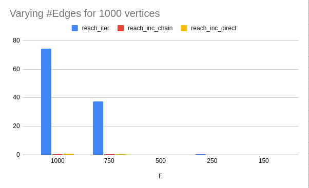
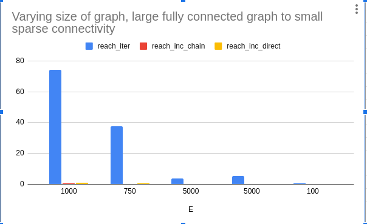
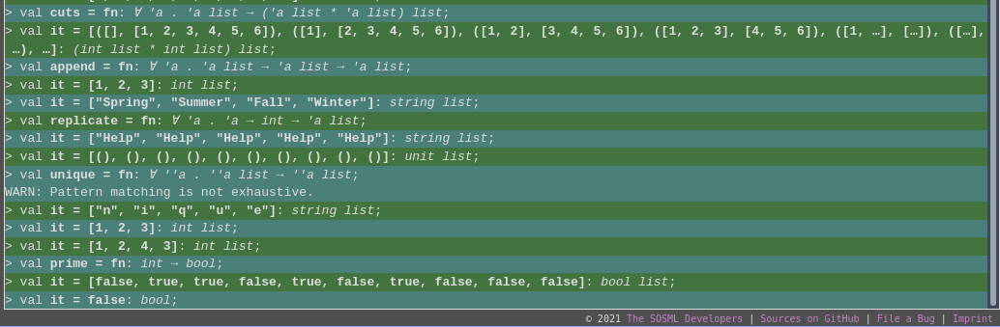

# CSE526: Assignment 3

> Sanket Goutam (sanket.goutam@stonybrook.edu)
> Student ID: 111463594
> Due date: Apr 18, 2022 11:59PM

## Prerequisites

I used the following resources for this assignment.


A. Python 3.8.10
B. SML (online) https://sosml.org/editor. 
C. SWI Prolog (online) https://swish.swi-prolog.org/. 
D. IDP (online)  http://verne.cs.kuleuven.be/idp/ 
D. Clingo (online)  https://potassco.org/clingo/run/ 

## A. Sets and Relations 

Refer to following files:

- a3sets.py           # main implementation
- a3sets_gen.py       # test generation script
- run_a3sets.sh       # bash script to run tests
- reach.in.*          # multiple test sets       
- A3_runtime_log.csv  # timing logs recorded here

Running the scripts:

``` python a3sets_gen.py 1000 200 2 ```

arg1 = V, arg2 = E, arg3 = S
V = no. of vertices, E = no. of edges, S = no. of source nodes

This will generate the file reach.in_1000_200_2 with randomly generated combinations
of edges, and source nodes.

You can directly run the following script to test over all generated files.

``` bash run_a3sets.sh ```

This bash script will run `python a3sets.py` with individual
reach.in_* files present in the same folder. The timing records
generated for timing of each function is recorded in the file
*A3_runtime_log.csv* file.

Refer to **a3sets.py** for details of implementation.

### Timing execution time of each function

I am using a python decorator class `timer` (ref. provided) to 
time execution time of individual functions. Effectively this will
only give the execution time for each function run, excluding
time spent in any preprocess tasks like file loading, succ_map 
processing, etc.

### Analysis of execution time

You can refer to all the information collected from several runs
on the generated datasets in the file `A3_runtime_log.csv` file.

Here I only summarize some interesting observations I was able
to make from my trial runs. Note that I have recorded all timings
in ms.

I particularly focus on these two charts because I find these two instances
more informative and easily explainable.



    	  V      E	reach_iter	reach_inc_chain	reach_inc_direct
        1000	1000	74.21	0.68	0.78
        1000	750	    37.52	0.36	0.4
        1000	500	    0.2	0	0
        1000	250	    0.53	0	0
        1000	150	    0.06	0	0


In figure 1, we notice the trend of execution times for each of these functions
as noticed by varying the number of edges while keeping the number of vertices
fixed (1000). All timing values are in ms. 

We clearly notice that `reach_iter` takes drastically more time to execute than
the other functions. This is interesting as it can be explained due to the fact
that reach_iter does not use any memorization or increment and update methods 
like the other two implementations use.

> Note: For reach_iter implementation, I faced some bugs while using 
> walrus operator for while loop implementation. I was trying to convert
> the image_union implementation into witness assignment inside while loop.
> But during testing of my program against randomly generated graphs, I was
> running into several issues. I ultimately decided to implement the algorithm
> provided in Slide #46 as is.



    V	E	reach_iter	reach_inc_chain	reach_inc_direct
    1000	1000	74.21	0.68	0.78
    1000	750	    37.52	0.36	0.4
    100000	5000	3.69	0.01	0
    10000	5000	5.4	    0.08	0.05
    100	    100	    0.69	0.05	0.04

While the previous graph is interesting, there are some unusually high
values noticed for `reach_iter` for the first two rows (1000,1000) and (1000, 750).
I decided to check the trends for fully connected graphs.
While `reach_iter` is itself more time consuming than other two functions,
what's interesting is that it takes substantially more time if it is a large
and fully connected graph.


## B. Recursive and higher-oreder functions

Refer to **a3rec.ml** for implementation.

I have used a scratch section in this file for all the test code.
The solution to each problem is provided at the very end of the
file.

For `append` function, I used the code that was discussed in class.
I believe it was Peter's answer that was discussed to be most 
accurate and I also found his answer to be quite easy to 
understand, so I have used his answer directly for append.



I have tested the code on the online code editor, against the
test cases provided in assignment description. Test cases
are provided in the file itself.

## C. Rules, as in logic programming

Refer to **a3rules.pl**

Suffix and cut functions are implemented with their test
cases provided in the file. Please use the online editor
to run the program and the test cases.

### Graph reachability 

I used the following variations of the rules for analysis.
As discussed with Professor during class, only focusing
on reordering of predicates, and disabling tabling.

    % Default rule
    reach(X) :- source(X).
    reach(X) :- edge(Y,X), reach(Y).

    % changing the order of reach and edge
    reach(X) :- source(X).
    reach(X) :- reach(Y), edge(Y,X).

    % exchanging two lines with each other
    reach(X) :- edge(Y,X), reach(Y).
    reach(X) :- source(X).

    % disable tabling with original order
    %:- table reach/1
    reach(X) :- source(X).
    reach(X) :- edge(Y,X), reach(Y).

**Results**

For Test 1:

    3 2 1 7 6 5 11 9 8 13 1.7600059509277344
    true

For Test 2:

    3 2 1 7 6 5 11 9 8 13 3.4999847412109375
    true

For Test 3:

    3 2 1 7 6 5 11 9 8 13 4.300117492675781
    true

For Test 4:
    Continuously running, stack overflow.


**Conclusions** :

Based on these experiments, we can conclude the following

+ If we disable tabling, the program takes forever to converge
    and the lack of saved values means that the solver is 
    repeatedly resolving the same values. Thus eventually
    resulting into stack limit errors.

+ If we reorder the predicates such that a recursive call is made
    first, like `reach(X) :- reach(Y), edge(X,Y)`, program becomes
    highly ineffective and can even end up in infinite loops.
    We should be taking care to not let a predicate recursively
    keep evaluating itself.

### Transitive closure and cycle detection

For path detection we are basically checking if a sequence of 
edges exist between any two given nodes.

For cycle detection, we extend this path predicate to find if
there is any node which has a path to itself.

In the program provided, if you uncomment the line `%edge(13,5).`
and run `printCycles` you will see the following output.

    7
    5
    11
    9
    13
    true


## Constraint programming

Refer to **a3nqueens.idp** for IDP and **a3nqueens.lp** for Clingo.

I tested the nqueens example provided on IDP and Clingo 
(both online), each with the small addition of the
distance predicate.

For IDP:

    !x1: !y1: !x2: !y2 : (queen(x1,y1) & queen(x2,y2) => x1=x2 | y1=y2 | (abs(x2-x1) + abs(y2-y1)) >= 5). 

For Clingo:

    I1 = I2, J1 = J2 :- q(I1, J1), q(I2, J2) , |I1 - I2| + |J1 - J2| < 7.


**Observations**:

+ IDP and Clingo are fairly fast in finding all possible solutions 
    to a constraint based problem. I guess these two languages
    are probably fairly powerful in this domain, which is difficult
    for languages like Python or C++ to match.
+ I tested the programs by varying the size of the chessboard from
    8, 10, 15, 20 and varying K values randomly until I found a 
    unsatisfiable configuration.

    It seems that the value of K is faily limited for each chess
    board size. For N = 8, K = 3. For N = 10, K = 4. For N = 20, 
    K = 5.

+ Maybe another interesting observation is that with increasing 
    size of the board the speed of the program starts to increase
    fairly exponentially. During my runs on Clingo, the execution
    time almost doubled between N = 15 to N = 20.


## Things to think about


**Pros and Cons of different languages**

I think each language had its own merits and demerits. 
For instance, SML was quite interesting to implement the programs
in but I did not find it fairly intuitive.

Coming from a systems programmer perspective, I am more used to
and comfortable with programming languages that let me control
what I am doing. With functional language, while the ideas
get conveyed fairly easily, it's much more difficult to 
debug or get used to.


**Languages allowing to write clear programs**

I think I really like Clingo in just how simple and clean the 
program was. As compared with IDP, which is a lot of bloated
code that seems fairly unintuitive.


**Single language to rule them all?**

Most languages are designed for _very_ specific use cases and
are rarely meant to be modular or generic. I think Python probably
comes the closest to being a multi-domain programming language,
but even that doesn't come with its own drawbacks.
When it comes to developing programming languages, I guess
utility and convenience both play an equal part.


## Extra credit II

Refer to file **a3extra2.py**

I implemented generate sequence, map, reduce, replicate, 
accumulate, and append functions from B.2.


